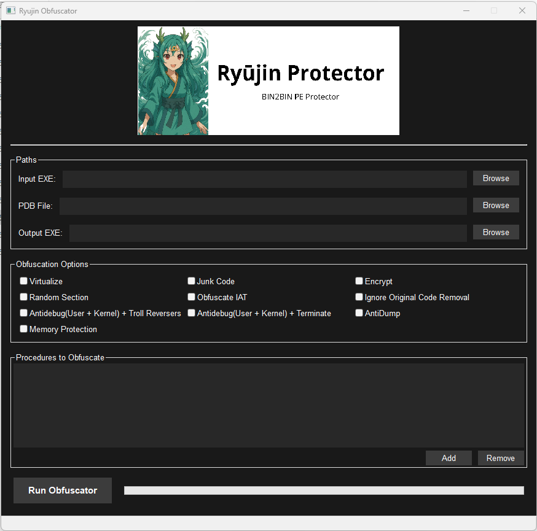
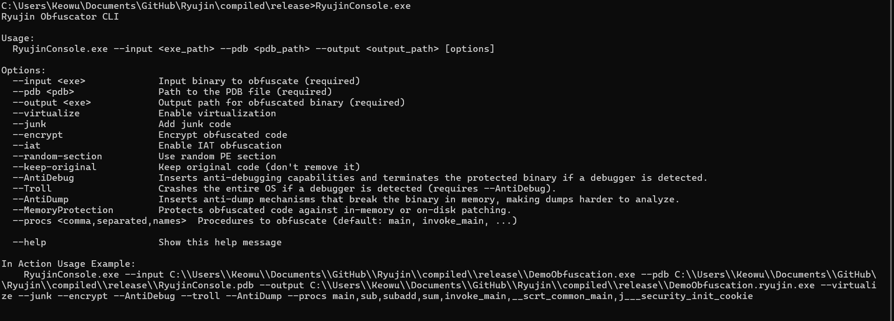

# Ryūjin Protector

**Ryūjin Protector** is an open-source **Bin2Bin** obfuscation, protection, and DRM tool for **Windows PE** binaries targeting the **Intel x64 architecture(Only)**.

  

---

## Features

- Junk Code Insertion + Code Mutation (Fully randomic without breaking the original logic)
- IAT Call Access Obfuscation(With obfuscated handlers access)
- Random Section naming(Default name: Ryujin)
- Mathematical Operators Virtualization(aka: Ryūjin MiniVM)
- Obfuscated code Encryption(Using TeaDelKew Algorithm)
- Anti-Debug User + Kernel
- Troll Reversers(Exclusive)
- Anti-Dump
- Anti-Disassembly + Anti-Decompiler
- Memory Protection(CRC32)
- Custom Passes(**TODO**)

---

## Demos and Presentations

Ryūjin was designed and developed for the study of obfuscators with Bin2Bin capabilities, making it a viable project for use by third parties as well as serious information security students. This includes: Commercial Developers, Indie Developers/Cheat Developers, Anti-Cheat Developers, Malware Developers, Malware Analysts, and Security Researchers.

**A Simple Comparison on a "main" function. before and after applying Ryūjin:**

This is only a small demo with only one Ryūjin feature, others feature together produce a better result.

**Really Easy to Use:**

**Ryūjin** is extremely easy to use — you can choose between the GUI mode or the CLI mode. Both will produce the same result in a precise, functional, and stable way.

GUI Mode Demonstration:

CLI Mode Demonstration:

For both options, you will need exclusively a PE file (Apanas, executable, for now) along with a PDB file containing the symbols for that PE file, so that you can protect and generate a new binary. Additionally, you can consult the WIKI at any time to discover other options and possibilities, such as custom passes.

---

## Getting Started

GITHUB_WIKI_URL
